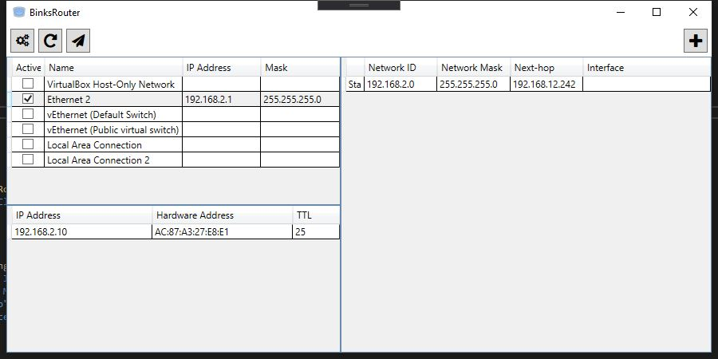

# BinksRouter

Simple .NET based software router for Windows implemented in C# using WPF.

## Credits

- App icon is [Internet Hub](https://icons8.com/icons/set/internet-hub) by [Icons8](https://icons8.com)
- For packet and device manipulation we use [sharppcap](https://github.com/chmorgan/sharppcap)

---
With ❤️ and ☕️ Jakub Dubec (c) 2020
